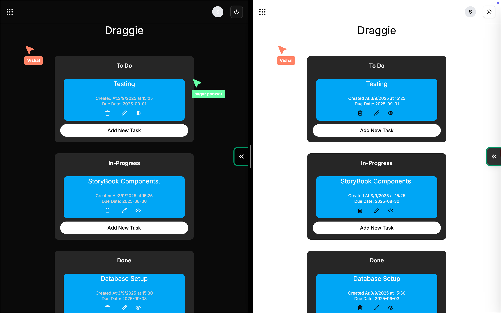
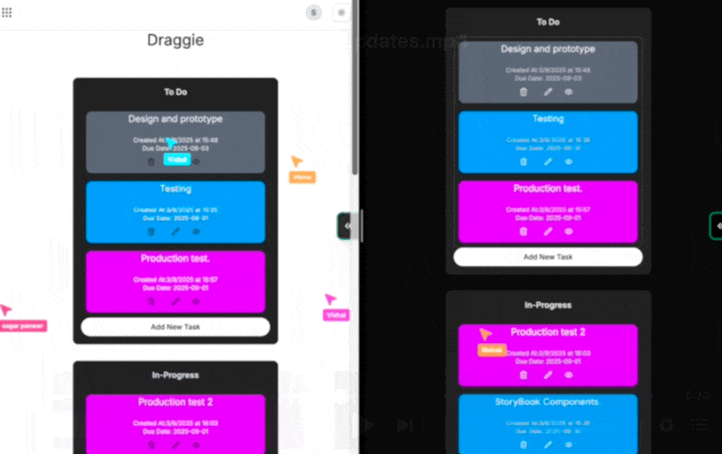
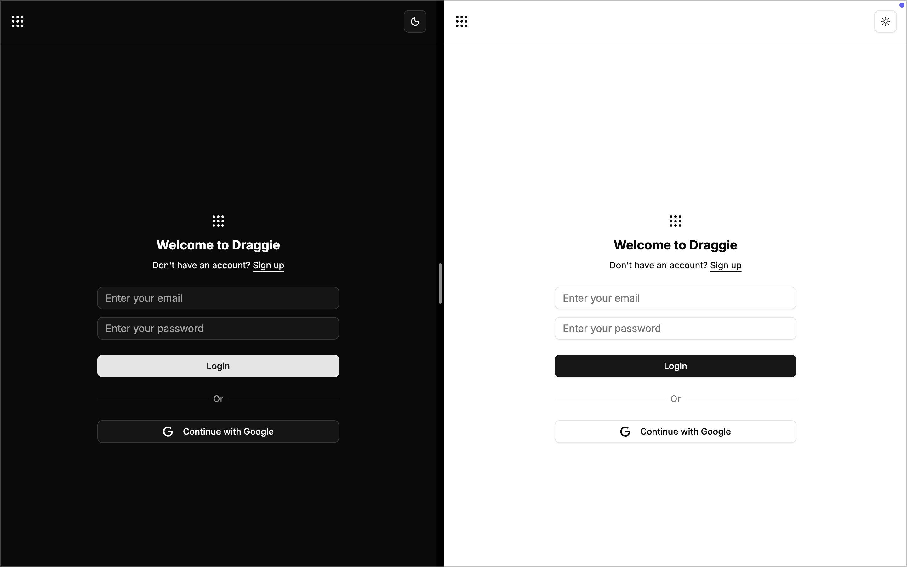

# Draggie — Realtime Collaborative Kanban

A realtime, collaborative kanban-style project management app with live cursors, chat, instant drag & drop updates, per-user task colors, and dark/light themes.

  <video controls playsinline muted loop style="width:100%; height:auto;">
    <source src="public/DemoPhotos/RealtimeUpdates-DemoVideo.mp4" type="video/mp4" />
    Your browser does not support the video tag.
  </video>

## Highlights

- Realtime collaboration:
  - Live multi-cursor presence across the board
  - Instant drag & drop sync for all users
  - In-app realtime chat with connection status and auto-reconnect
- Personalized task colors per user to easily differentiate ownership
- Dark and Light themes with polished UI
- Mobile-friendly drag and drop with touch optimizations

---

## Realtime Collaboration

### Live Multi‑Cursor Presence

See where teammates are and what they’re focusing on—instantly.

  

### Instant Drag & Drop Updates

Move tasks and watch updates reflect immediately for everyone—no refresh needed.

  

### Realtime Chat

Discuss tasks inline with a fast, reliable chat that auto-reconnects and shows connection state.

  

---

## Personalized Task Colors

Each user gets a unique color so you can quickly scan the board and understand who owns what.

  

---

## Dark & Light Themes

Comfortable viewing day or night with seamless theme switching.

  

---

## Tech Stack

- Next.js + React
- Supabase Realtime
- Tailwind CSS + shadcn/ui
- DnD Kit
- Zustand + React Query
- date-fns

---

## Quick Start

1. Install dependencies:

   - npm install

2. Create .env.local with:

   - NEXT_PUBLIC_SUPABASE_URL
   - NEXT_PUBLIC_SUPABASE_ANON_KEY

3. Run the dev server:
   - npm run dev

Build:

- npm run build
